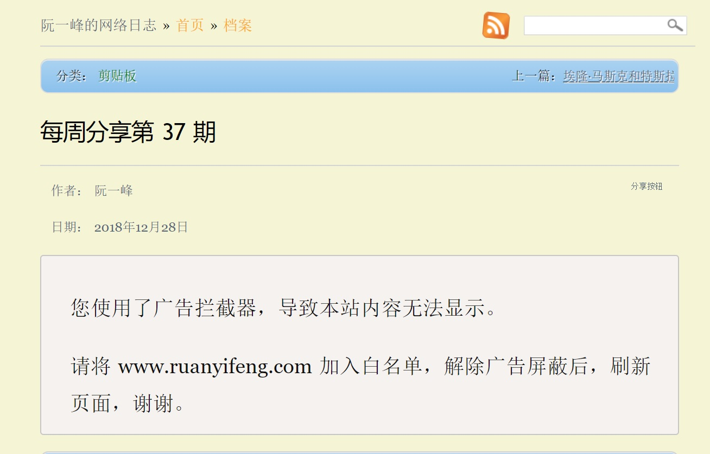
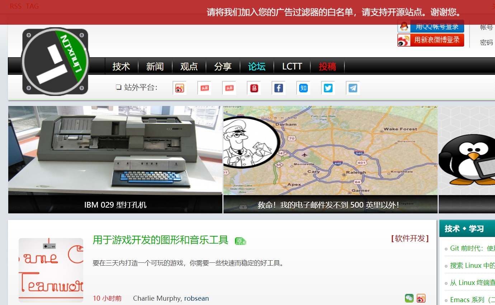

# KeepABPOn
I will never turn off my ABP for your ridiculous, unreasonable and unbearable excuses.

# Description
**No websites should ever forced a user to turn off their ad blocker unless he wanted to.** 

I create this repository for this purpose: Ads should never interrupt normal reading experience.

# Quick Start Guide
Search on [Greasy Fork](https://greasyfork.org) with keyword `KAO` or check on the following list.

# List of Websites
## KAO#1: ruanyifeng
Keep ABP on while reading on [ruanyifeng.com](https://www.ruanyifeng.com)
[ryf.js](https://greasyfork.org/zh-CN/scripts/376131-kao-1-ruanyifeng)

# Rules of Engagement
1. Websites force you to turn off ad blocker.
2. If you don't turn it off, the main content would be hidden.

## Engage example

## Disengage example

# Contribution
Everyone is welcomed to submit PRs/issues about websites, fix and workaround.

# License
MIT License